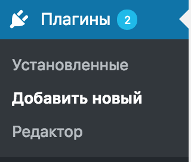
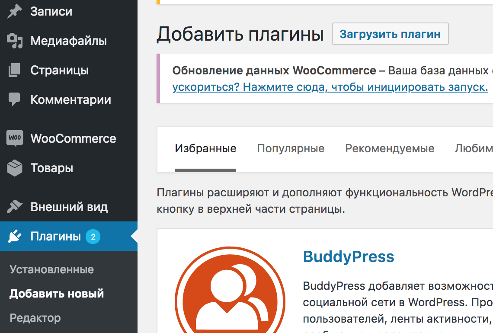
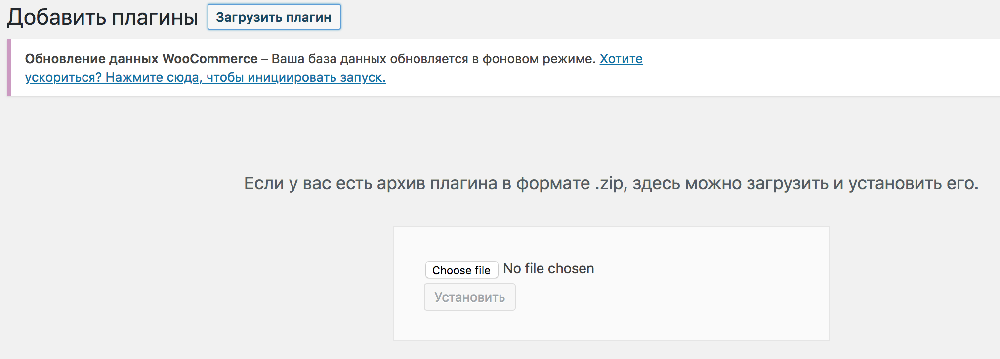
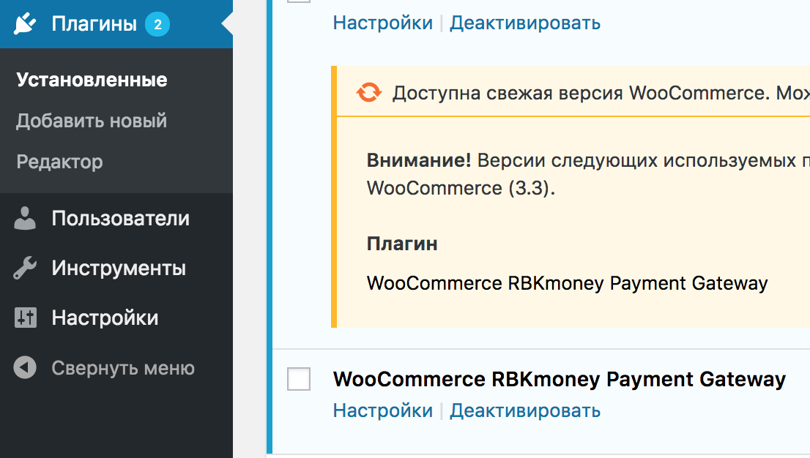
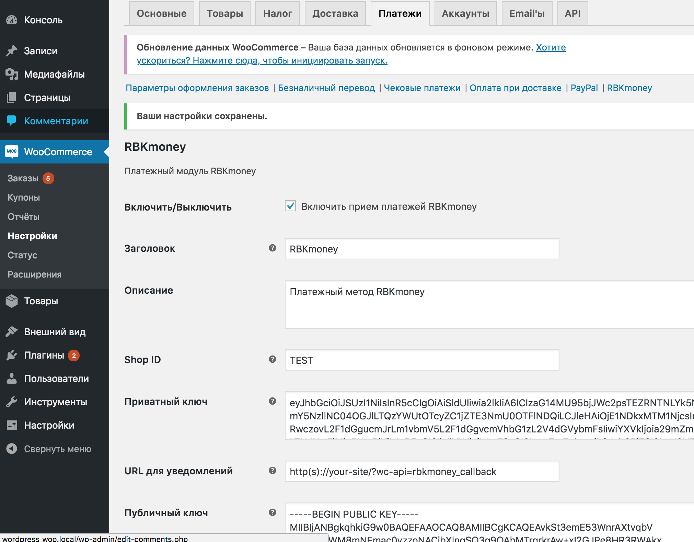

# rbkmoney-cms-wp-woo-commerce

Пожалуйста, обязательно делайте бекапы!

Платежный плагин RBKmoney для Wordpress + WooCommerce

Модуль разрабатывался и тестировался на Wordpress 4.9.2, WooCommerce 3.2.6

#### Требования

- PHP 5.4 (минимум)
- OpenSSL - 1.0.2k-fips (минимум)
- Curl

#### Доступные ставки НДС для корзины

- ничего не указано - без НДС
- 0 - 0% НДС
- 10 - 10% НДС
- 18 - 18% НДС

### Установка и настройка модуля

#### Установка без архива

- Поместите файл в директорию `wp-content/plugins/rbkmoney-cms-wp-woo-commerce`

#### Установка с архивом
- Скачайте zip-файл с плагином из раздела [releases](https://github.com/rbkmoney/rbkmoney-cms-wp-woo-commerce/releases) и загрузите его.

Выберите `Плагины` -> `Добавить новый`, как показано на изображении

Нажимаем `Загрузить плагин`

Нажимаем `choose file`, указываем путь к файлу с архивом и нажимаем кнопку `Установить`

Чтобы активировать установленный плагин, необходимо выбрать `Плагины` -> `Установленные`, находим модуль `WooCommerce RBKmoney Payment Gateway` и нажимаем `Активировать`

После чего можем заняться настройкой модуля.

#### Для начала приема платежей на Вашем сайте необходимо:

Чтобы произвести настройки плагина необходимо выбрать `Плагины` -> `Установленные`, находим модуль `WooCommerce RBKmoney Payment Gateway` и нажимаем `Настройки`

Видим поля:

Настройте плагин в соответствии с данными из [личного кабинета RBKmoney](https://dashboard.rbk.money).

`Shop ID` - идентификатор магазина из RBKmoney. Скопируйте его в Личном кабинете RBKmoney в разделе Детали магазина, поле Идентификатор;

`Приватный ключ` - ключ для доступа к API. Скопируйте его в Личном кабинете RBKmoney в разделе API Ключ

`Публичный ключ` - ключ для обработки уведомлений о смене статуса

- Заходим в личный кабинет RBKmoney: Создать Webhook;
- Вставляем в поле URL вида `http(s)://your-site/?wc-api=rbkmoney_callback`, скопированного из `URL для уведомлений`
- Выбираем Типы событий `InvoicePaid` и `Invoice Canсelled`;
- после создания Webhook-а копируем Публичный ключ после нажатия Показать детали;
- скопированный ключ вставляем в поле `Публичный ключ` на странице настроек модуля;

- Сохраните изменения и проведите тестовый платеж

В настройках модуля можно включить или отключить логирование `Журнал отладки`, с ними можно ознакомиться по пути указанном в настройках модуля

### Нашли ошибку или у вас есть предложение по улучшению модуля?

Пишите нам support@rbkmoney.com При обращении необходимо:

- Указать наименование CMS и компонента магазина, а также их версии
- Указать версию платежного модуля (доступна на странице Усправление пакетами)
- Описать проблему или предложение
- Приложить снимок экрана (для большей информативности)
